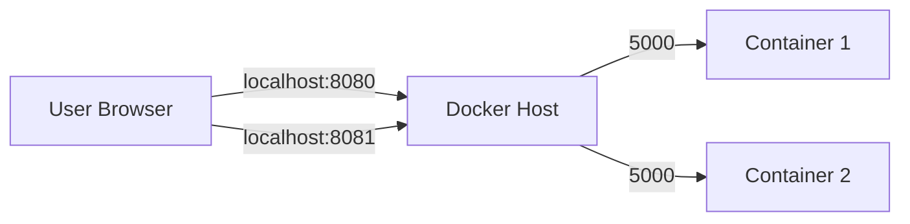
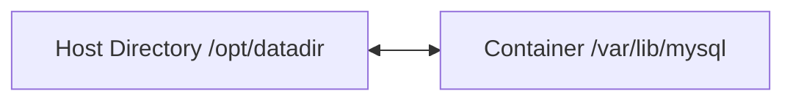

# 🐳 Basic Docker Commands (Quick & Clean Guide)

## 🚀 Run Containers

```bash
docker run <image>
```
Run a container from an image.

Example:
```bash
docker run centos
```

### Run in Detached Mode (Background)
```bash
docker run -d <image>
```

### Run with Specific Version (Tag)
```bash
docker run <image>:<tag>
```

Example:
```bash
docker run ubuntu:17.10
```

### Run Container with a Custom Name

```bash
docker run --name <container_name> <image>
```

Example:
```bash
docker run --name my_ubuntu ubuntu
```

---

## 📦 Container Management

### List Running Containers
```bash
docker ps
```

### List All Containers (including stopped)
```bash
docker ps -a
```

### Stop a Container
```bash
docker stop <container>
```

### Remove Container(s)
```bash
docker rm <container1> <container2>
```

---

## 🖼️ Image Management

### List Images
```bash
docker images
```

### Pull Image (Download Only)
```bash
docker pull <image>
```

### Remove Image
```bash
docker rmi <image>
```

⚠️ If image is used by a container → remove container first.

---

## 🧠 Execute Commands Inside Container

```bash
docker exec <container> <command>
```

Example:
```bash
docker exec ubuntu_container cat /etc/*release*
```

---

## 🔗 Attach / Inspect

### Attach to Running Container
```bash
docker attach <container>
```

### Inspect Container (IP, config, etc.)
```bash
docker inspect <container>
```

---

## 💻 Interactive Mode

### STDIN
```bash
docker run -i <image>
```

### Terminal
```bash
docker run -t <image>
```

### Full Interactive Terminal
```bash
docker run -it <image>
```

---

## 🌐 Port Mapping

```bash
docker run -p <host_port>:<container_port> <image>
```

Example:
```bash
docker run -p 8080:5000 jenkins
```

### 🔁 Multiple Instances Example

```bash
docker run -p 8080:5000 myapp
docker run -p 8081:5000 myapp
```

⚠️ You cannot use the same host port twice.

### 📊 Diagram



---

## 💾 Data Persistence (Volumes)

Without volumes → data is lost when container stops.

```bash
docker run -v <host_dir>:<container_dir> <image>
```

Example:
```bash
docker run -v /opt/datadir:/var/lib/mysql mysql
```

### 📊 Diagram



---

## 📜 Logs

```bash
docker logs <container>
```

View logs printed to STDOUT.

---

## 🧰 Useful Images (for Backend Devs)

### 🟢 Databases
```bash
docker run -d postgres
docker run -d mysql
docker run -d mongo
```

### 🔴 Java / Backend
```bash
docker run -d openjdk
docker run -d maven
```

### ⚙️ Dev Tools
```bash
docker run -d jenkins
docker run -d redis
docker run -d nginx
```

### 🧪 Utility / Fun
```bash
docker run timer
```

---

## ⚡ Quick Notes

- Containers are **ephemeral** (unless you use volumes)
- Images are **read-only templates**
- Think of containers like **running processes**
- Port mapping = exposing container apps to your machine
- Volumes = persistence layer

---