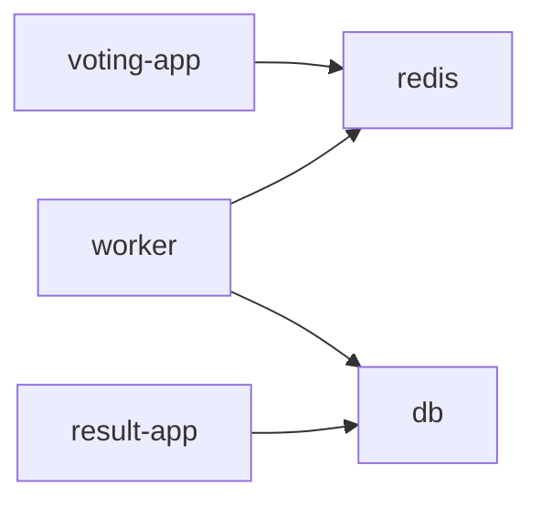
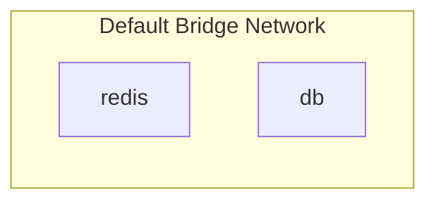
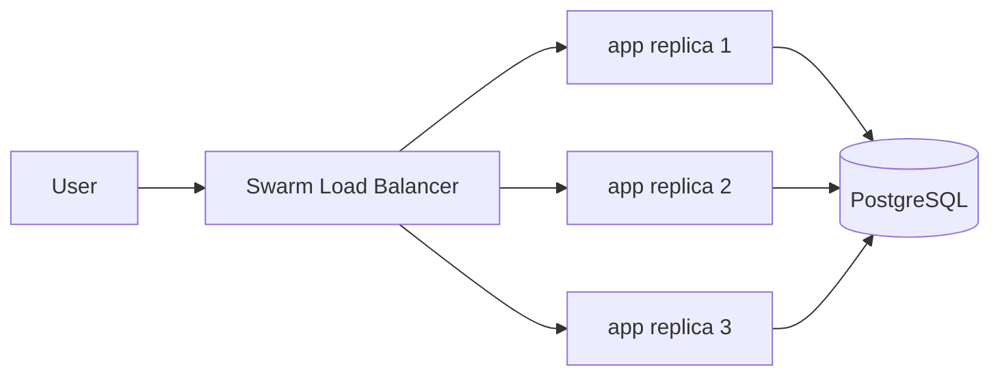
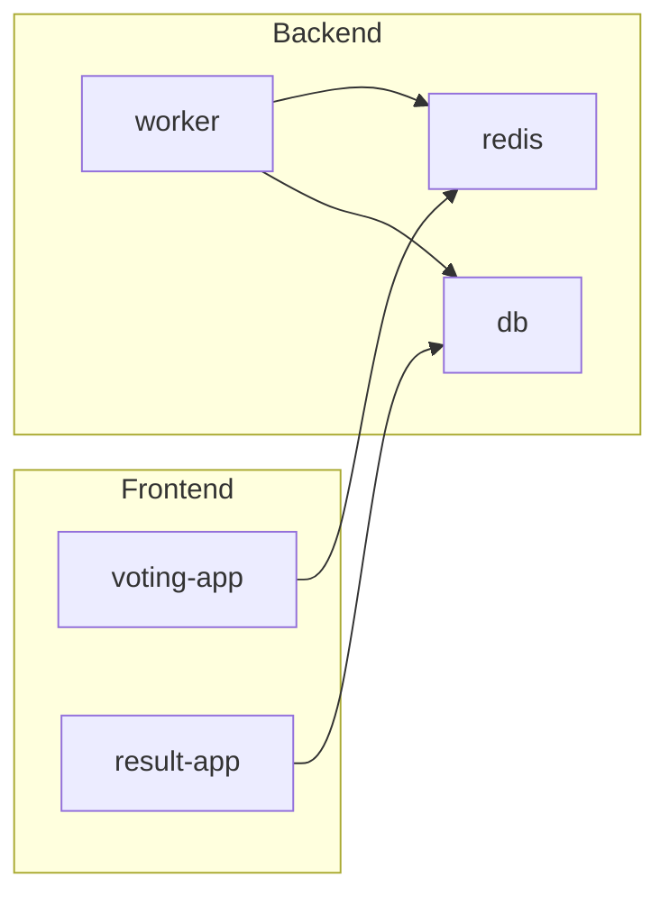

# 🐳 Docker Compose — Running Multi-Container Applications

---

## 📌 What is Docker Compose?

Docker Compose lets you define and run **multi-container Docker applications** using a single YAML file.

Instead of:

* Running containers one by one
* Manually wiring networking
* Managing dependencies yourself

You define everything declaratively and run:

```bash
docker compose up
```
---

## ⚠️ Assumption

In all the examples below, it is assumed that:

> ✅ **All required images (`voting-app`, `worker`, `result-app`, etc.) are already built and available on a Docker registry (like Docker Hub or locally).**

---
---

## 🚫 Running Services Individually (Painful Way)

### Example: Voting App Architecture


---

### Running each container manually

```bash
docker run -d --name redis redis

docker run -d --name db postgres

docker run -d --name voting-app -p 5000:8000 voting-app

docker run -d --name result-app -p 5001:8080 result-app

docker run -d --name worker worker
```

---

## ❌ Problem: Containers Cannot Talk

Each container:

* Runs in isolation
* Has its own network namespace
* Cannot resolve other containers by name

So:

* `voting-app` cannot reach `redis`
* `worker` cannot reach `db`

---

## 🔗 Old Solution: Linking Containers

```bash
docker run -d --name voting-app --link redis:redis voting-app

docker run -d --name result-app --link db:db result-app

docker run -d --name worker \
  --link redis:redis \
  --link db:db worker
```

### Visualization



### ⚠️ Why avoid this?

* Tight coupling between containers
* Hard to scale
* Manual wiring required
* Not flexible for real-world systems

---

## ✅ Docker Compose Solution

### docker-compose.yaml (Version 2)

```yaml id="g7x2lm"
version: "2"

services:
  redis:
    image: redis
    container_name: redis-container

  db:
    image: postgres
    container_name: postgres-container

  voting-app:
    image: voting-app
    container_name: voting-app-container
    ports:
      - "5000:8000"
    depends_on:
      - redis

  worker:
    image: worker
    container_name: worker-container
    depends_on:
      - redis
      - db

  result-app:
    image: result-app
    container_name: result-app-container
    ports:
      - "5001:8080"
    depends_on:
      - db
```

---

## 🧠 What’s happening here?

* All services are on the **same default network**
* Each service gets a **DNS name = service name**

So inside containers:

* `redis` → resolves to Redis container
* `db` → resolves to PostgreSQL container

No linking needed.

---
## 🧠 Container Naming in Docker Compose

### 🔹 Default Naming Convention

If you **don’t specify `container_name`**, Docker Compose automatically names containers like:

```id="c6rf9q"
<project-name>_<service-name>_<index>
```

### Example

If your folder is named `voting-app`, then:

```id="tljbwb"
voting-app_redis_1
voting-app_db_1
voting-app_voting-app_1
voting-app_worker_1
voting-app_result-app_1
```

---

## 🔹 How Project Name is Decided

By default:

* It uses the **folder name**

You can override it:

```bash id="4rj2z3"
docker compose -p myproject up
```

Then names become:

```id="9yl7zn"
myproject_redis_1
myproject_db_1
```

---

## 🔹 Custom Container Names

You can explicitly set names using:

```yaml id="3d0m2r"
container_name: my-custom-name
```

---

## ⚠️ Important Notes

* `container_name` must be **unique**
* You **cannot scale** services with `container_name`

❌ This will break:

```bash id="m9r0ok"
docker compose up --scale worker=3
```

Because:

* Docker cannot create multiple containers with the same name

---

## 🧠 Best Practice

* Avoid `container_name` unless really needed
* Use **service names for communication**, not container names

Example:

```python id="pj9sxm"
host="redis"   # ✅ correct
```

NOT:

```python id="9x4v9t"
host="redis-container" ❌
```

---

## 🔥 Key Insight

👉 Service name = DNS hostname inside Docker network
👉 Container name = just a label for humans

---

## ▶️ Run Everything

```bash
docker compose up
```

---

## 🏗️ Build Instead of Pull

If images are not on Docker Hub:

```yaml
voting-app:
  build: ./voting-app
```
Mention the directory with source code (here: ./voting-app) under the key "build"

Then:

```bash
docker compose build
docker compose up
```

---
---

## 🔄 Docker Compose Versions

## 🧱 Version 1 (Legacy)

### Example

```yaml
redis:
  image: redis

db:
  image: postgres
```

### Limitations

* No `services` grouping
* No custom networks
* No dependency management
* Uses default bridge network only

### Visualization



---

## 🧱 Version 2 (Most Practical)

### Example

```yaml
version: "2"

services:
  app:
    image: myapp
    depends_on:
      - db

  db:
    image: postgres
```

### Features

* Introduced `services`
* Supports `depends_on`
* Supports custom networks
* Automatic DNS resolution

### Startup Behavior


(`db` starts before `app`)

---

## 🧱 Version 3 (Swarm Mode)

### Example

```yaml
version: "3"

services:
  app:
    image: myapp
    deploy:
      replicas: 3

  db:
    image: postgres
```

---

## 🧠 What this actually does

* Instead of running a **single container**, Docker runs **multiple identical replicas** of the same service
* These replicas are distributed and managed by **Docker Swarm**
* Traffic is automatically load-balanced across replicas

---

## 📊 Visualization



---
---

## 🌐 Networks in Docker Compose

## Default Network (Auto-created)

When you run:

```bash
docker compose up
```

Docker creates:


All containers can talk freely.

---

## 🔥 Custom Networks

We split traffic into:

* **Frontend network (FE)** → user-facing services
* **Backend network (BE)** → internal services

---

### Architecture



---

## docker-compose.yaml with Networks

```yaml
version: "2"

services:
  redis:
    image: redis
    networks:
      - backend

  db:
    image: postgres
    networks:
      - backend

  voting-app:
    image: voting-app
    ports:
      - "5000:8000"
    networks:
      - frontend
      - backend

  worker:
    image: worker
    networks:
      - backend

  result-app:
    image: result-app
    ports:
      - "5001:8080"
    networks:
      - frontend
      - backend

networks:
  frontend:
  backend:
```

---

## 🧠 Why this is powerful

* **Isolation** → frontend cannot directly access DB
* **Security** → backend hidden
* **Scalability** → services can grow independently

---

## 🚀 Service Communication (Important)

Inside containers, use:

| Service | Hostname |
| ------- | -------- |
| Redis   | `redis`  |
| DB      | `db`     |

Example:

```python
redis.Redis(host="redis")
```

---
---

## ⚠️ depends_on Clarification

`depends_on`:

* Ensures **startup order**
* Does **NOT** guarantee service is ready

For real apps:

* Add retry logic
* Or use wait-for scripts

---
---

## 🧠 Key Takeaways

* Docker Compose simplifies multi-container systems
* Built-in DNS removes need for linking
* Version 2 is most commonly used
* Networks allow clean architecture separation
* `depends_on` controls order, not readiness
* Always use service names instead of `localhost`

---
