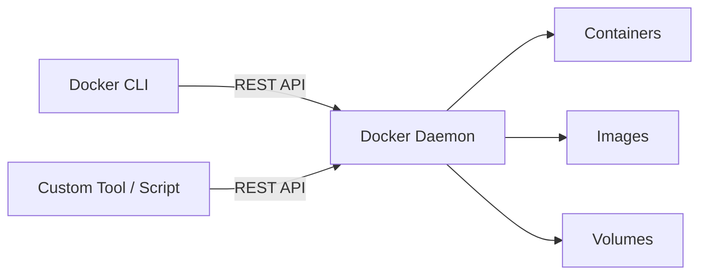
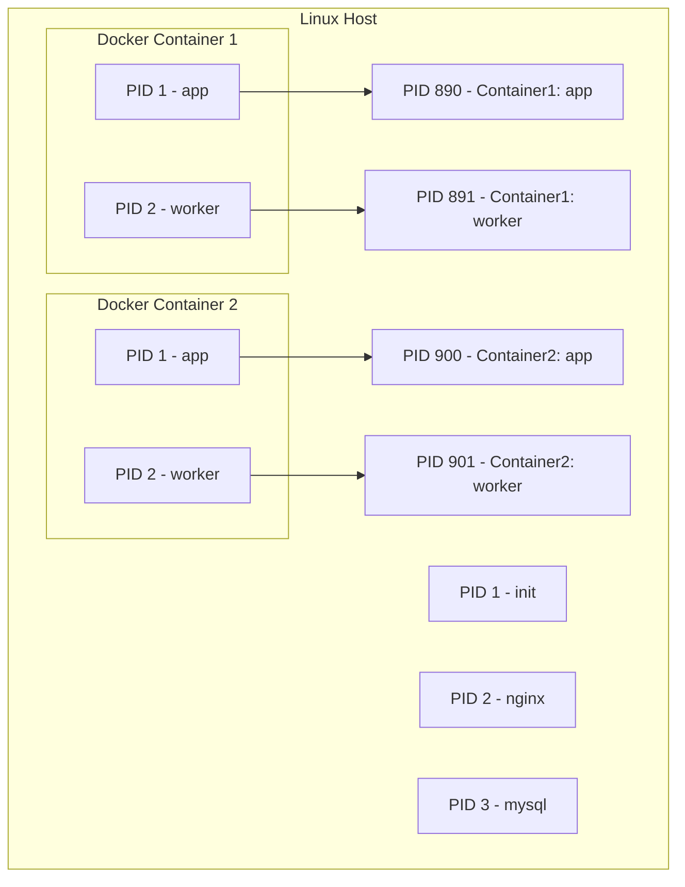
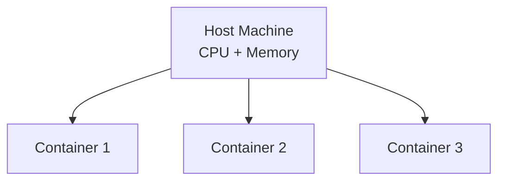
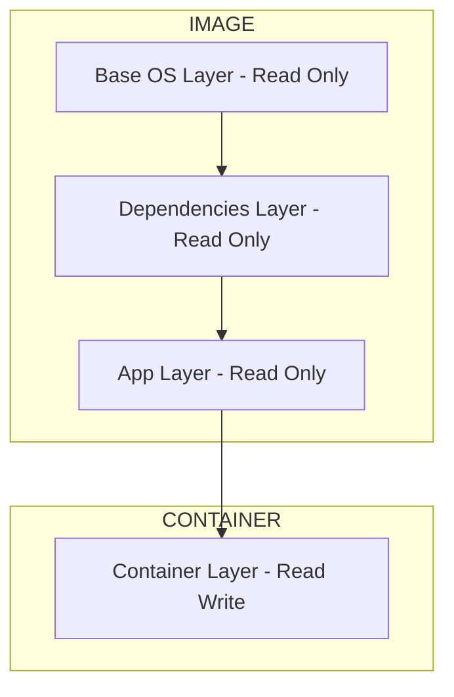
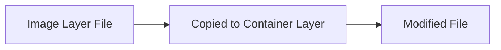
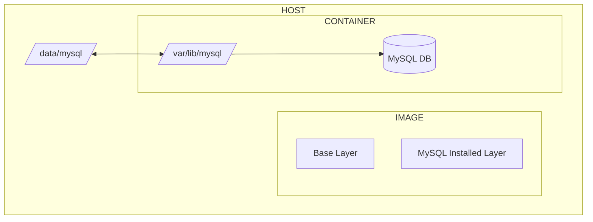
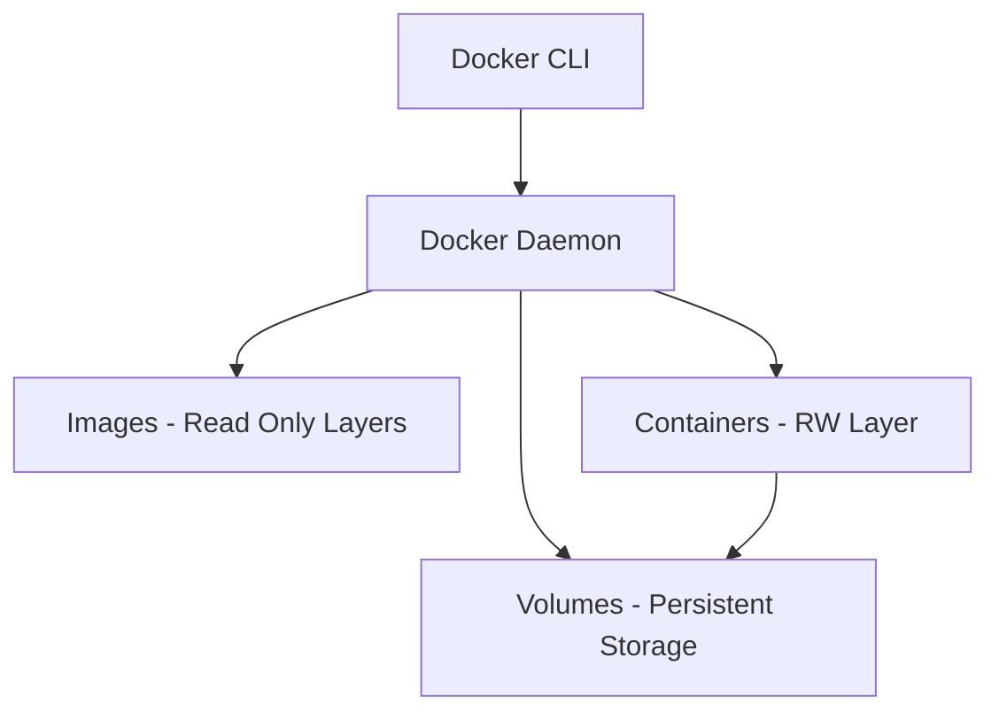

# 🐳 Docker Engine & Storage — Complete Guide

---

## 📌 What is Docker Engine?

**Docker Engine = Host machine with Docker installed**

It provides the runtime to:
- Build images
- Run containers
- Manage networking & storage

---

## ⚙️ Components of Docker Engine (Linux)

When Docker is installed on Linux, it includes:

### 1. 🧠 Docker Daemon (`dockerd`)
- Background service running on the host
- Responsible for:
  - Managing containers
  - Managing images
  - Handling volumes & networks

---

### 2. 🌐 REST API Server
- Exposes Docker functionality via HTTP APIs
- Allows:
  - External tools
  - Automation scripts
  - Custom applications

👉 You can build your **own tools** using this API

---

### 3. 💻 Docker CLI (`docker`)
- Command-line interface used by users
- Sends commands to the daemon via REST API

---

## 🧩 Architecture Visualization



---

## 🌍 Remote Docker Engine

Docker CLI **does NOT need to be on the same host**

You can connect to a remote Docker Engine:

```bash
docker -H=<remote-docker-engine-address>:<port> <command>
```

### ✅ Example

```bash
docker -H=192.168.1.10:2375 ps
```

👉 Lists containers running on a remote Docker host

---

## 🔐 Isolation using Namespaces

Docker uses **Linux namespaces** to isolate containers.

Each container gets its own:
- PID namespace
- Network namespace
- Filesystem namespace

---

## 🧠 PID Namespace Visualization



👉 Inside the container, process starts from **PID 1**, even though host has its own PIDs

---

## ⚡ Resource Sharing (Default Behavior)

Containers share host resources:
- CPU
- Memory

👉 No limits by default

---

## 🧠 Resource Sharing Visualization



---

## 🚫 Restricting Resources using cgroups

Docker uses **cgroups (control groups)** to limit resources

### ✅ Examples

```bash
docker run --cpus=.5 ubuntu
```

👉 Container can use only **50% of a CPU**

```bash
docker run --memory=100m ubuntu
```

👉 Container limited to **100 MB RAM**

---

## 📂 Docker File System

Docker stores everything in:

```bash
/var/lib/docker/
```

### Important folders:
- `images/`
- `containers/`
- `volumes/`
- `aufs/` or `overlay2/`

👉 This is Docker's internal storage

---

## 🧱 Image Layered Architecture

- Images are made of **layers**
- Layers are:
  - Read-only
- Container adds a:
  - **Top writable layer**

---

## 🧠 Layer Visualization



---

## 🔁 Copy-On-Write Mechanism

- When container modifies a file:
  - File is **copied** from image layer
  - Changes happen in container layer

---

## 🧠 Copy-On-Write Visualization



👉 Original image stays unchanged

---

## ⚠️ Important

- Container layer exists **only while container runs**
- When container stops → data is lost
- Image layers remain unchanged

---

## 💾 Persisting Data

---

## 📦 Volume Mounting

Create volume:

```bash
docker volume create mydata
```

Run container:

```bash
docker run -v mydata:/app/data ubuntu
```

---

## 📁 Bind Mounting

Mount custom host directory:

```bash
docker run -v /home/user/mysql-data:/var/lib/mysql mysql
```

---

## ✅ Modern Way (`--mount`)

```bash
docker run \
  --mount type=bind,source=/data/mysql,target=/var/lib/mysql \
  mysql
```

---

## 🧠 MySQL Mount Visualization



👉 Data is stored on host → survives container deletion

---

## 🧠 Key Concept

- Image layers → read-only
- Container layer → temporary
- Volumes → persistent

---

## ⚙️ Storage Drivers

Docker uses storage drivers for layered architecture:

Examples:
- aufs
- zfs
- btrfs
- device mapper
- overlay
- overlay2 (most common)

👉 Docker automatically selects based on OS

---

## 📁 Layer Storage

- Each layer = folder inside `/var/lib/docker`
- Structure depends on storage driver

---

## 🔍 Inspect Docker System

```bash
docker info
```

👉 Shows:
- Storage driver
- Root directory
- Running containers
- System-wide info

---

## 🧠 Final Mental Model



---
