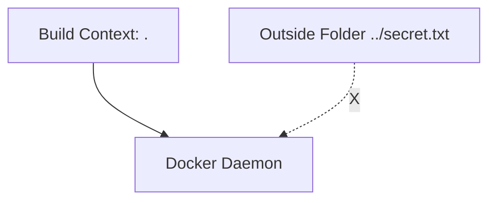
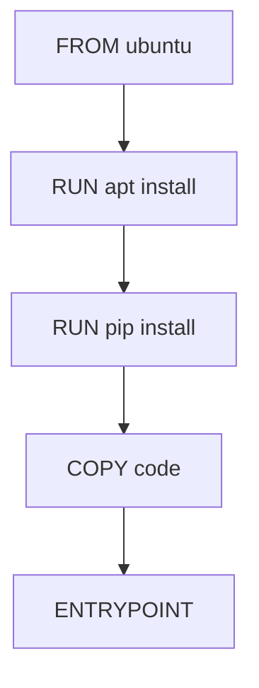
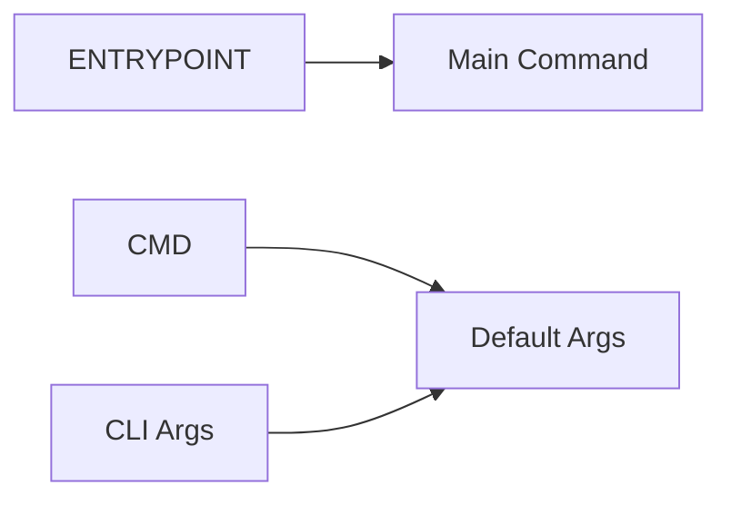

# 🐳 Building & Understanding Docker Images (Clean Guide)

---

## 🎯 Goal
Create your own Docker image (example: Flask app) and understand how Docker builds, runs, and manages it.

---
---

## 🧱 Step-by-Step (Flask Example)

1. Base OS → Ubuntu  
2. Update packages  
3. Install system dependencies  
4. Install Python dependencies  
5. Copy source code  
6. Run the app  

---

## 📄 Dockerfile (Flask)

```dockerfile
# Base OS
FROM ubuntu

# Install system dependencies
RUN apt update && apt -y install python3 python3-pip

# Install Python dependencies
RUN pip3 install flask flask-mysql

# Copy source code
COPY . /opt/source-code

# Run the app
ENTRYPOINT FLASK_APP=/opt/source-code/app.py flask run
```

---

## 📦 COPY (Local → Image)


- Left = your system  
- Right = inside Docker image  

---

## ⚙️ Build Image

```bash
docker build . -f Dockerfile -t <docker-hub-username>/<image-name>
```
``` -f ``` -> to mention the Dockerfile     
``` -t ``` -> to name the image

Example:
```bash
docker build . -f Dockerfile -t sumanthgma4/flask-app
```

---

## 📁 Build Context (VERY IMPORTANT)

The `.` at the end = **build context**

👉 It tells Docker:
> "Only files inside this directory are accessible"

### ❌ Invalid

```dockerfile
COPY ../secret.txt /app
```

Won’t work because file is outside context.

---

### 📊 Visualization



- Docker only sees files inside `.`  
- Anything outside = invisible  

---

## 🚀 Push Image

```bash
docker push <docker-hub-username>/<image-name>
```

Example:
```bash
docker push sumanthgma4/flask-app
```

---

## 🧱 Docker Image Layers

Each Dockerfile instruction = a layer



### 🧠 Key Points

- Each layer stores **only changes from previous layer**
- Layers are **cached**
- Faster builds:
  - No change → reuse cache
  - Change → rebuild only affected layers

---

## 🔍 Inspect Layers

```bash
docker history <image>
```

Example:
```bash
docker history sumanthgma4/flask-app
```

---

## ⚡ Build Behavior

- Uses cached layers if unchanged  
- Rebuilds only changed layers  
- On failure → reuses successfully built layers up to that point  

---
---

## Examples of a few more Dockerfiles

### ☕ Spring Boot (Simple Dockerfile)

```dockerfile
FROM openjdk:17-jdk-slim

WORKDIR /app

COPY target/app.jar app.jar

ENTRYPOINT ["java", "-jar", "app.jar"]
```

---

### 🐍 Django (Simple Dockerfile)

```dockerfile
FROM python:3.10

WORKDIR /app

COPY . /app

RUN pip install -r requirements.txt

ENTRYPOINT ["python", "manage.py", "runserver", "0.0.0.0:8000"]
```

---
---

## 🌱 Environment Variables

### Set env variable

```bash
docker run -e <ENV>=<value> <image>
```

Example:
```bash
docker run -e DB_HOST=localhost myapp
```

### Inspect env variables

```bash
docker inspect <container>
```

---
---

# ⚙️ CMD vs ENTRYPOINT 

## 🧠 Core Concept 

- Containers are **not VMs**
- They are meant to run **a single task**
  - web server  
  - app server  
  - database  
  - or any process  

👉 Once the task stops → **container exits**

### Examples: Some default CMDs for a few images:
- For Ubuntu:
```dockerfile
CMD ["bash"]
```
- For Nginx:
```dockerfile
CMD ["nginx"]
```
- For MySQL
```dockerfile
CMD ["mysqld"]
```

---

## 🧾 Why Ubuntu Container Exits Immediately

Default Ubuntu image:

```dockerfile
CMD ["bash"]
```

Now:

- `bash` = shell waiting for input  
- Docker does NOT attach terminal by default  

👉 So:
- No input → bash exits  
- bash exits → container exits  

✔️ Your understanding here is **correct**

---

## 🧾 CMD → Default Command

CMD defines:

> "Run this command when container starts (unless overridden)"

### Syntax
```dockerfile
CMD ["command", "param1"]
```

### Example

```dockerfile
CMD ["sleep", "50"]
```

Run:
```bash
docker run myimage
```

→ Runs:
```bash
sleep 50
```

---

### 🧠 Override CMD 

```bash
docker run ubuntu sleep 50
```

✔️ This works because:
- CMD gets replaced by CLI command  

---

### 🛠️ Permanent CMD via Dockerfile

```dockerfile
FROM ubuntu
CMD ["sleep", "50"]
```

Build:
```bash
docker build -t sumanthgma4/ubuntu-sleeper .
```

Run:
```bash
docker run sumanthgma4/ubuntu-sleeper
```

---

### 🧠 CMD Formats 

1. Shell form:
```dockerfile
CMD sleep 50
```

2. JSON form (preferred):
```dockerfile
CMD ["sleep", "50"]
```

✔️ JSON form is better → avoids shell issues

---

## 🚀 ENTRYPOINT → Fixed Command

ENTRYPOINT defines:

> "This is the main command. Always run this."      
> And it takes the CLI arguments as the params for the command mentioned

---

### Example

```dockerfile
ENTRYPOINT ["sleep"]
```

Run:
```bash
docker run ubuntu-sleeper 10
```

→ Runs:
```bash
sleep 10
```
Here ``` 10 ``` is taken as the param for the ``` sleep ``` command

✔️ CLI args are appended 

---

## ❗ Problem which occurs with ENTRYPOINT

```bash
docker run ubuntu-sleeper
```

→ Error:
```
sleep: missing operand
```

✔️ Because ENTRYPOINT needs argument

---

## ✅ ENTRYPOINT + CMD 

```dockerfile
ENTRYPOINT ["sleep"]
CMD ["50"]
```

---

### Now the behavior of the above command is

| Command | Final Execution |
|--------|----------------|
| `docker run image` | sleep 50 |
| `docker run image 10` | sleep 10 |

✔️ Exactly how Docker works

---

## 🔁 Override CMD 

```bash
docker run ubuntu-sleeper sleep 10
```

👉 Works, but looks weird because:
- you're replacing full command

✔️ This is why ENTRYPOINT is preferred for CLI-style tools

---

## 🛠️ Override ENTRYPOINT 

```bash
docker run --entrypoint <new-command> ubuntu-sleeper 10
```

Example:
```bash
docker run --entrypoint echo ubuntu-sleeper hello
```

→ Runs:
```bash
echo hello
```


---

## 📊 Final Mental Model



---

## 🔥 Simple Analogy

- ENTRYPOINT = function name  
- CMD = default argument  
- CLI args = user input  

```python
def sleep(seconds=50):
    pass
```

---

## ⚖️ Summary

| Feature | CMD | ENTRYPOINT |
|--------|-----|-----------|
| Role | Default command | Main command |
| Overridable | Yes | Only via --entrypoint |
| CLI behavior | Replaces | Appends |
| Best use | Defaults | Fixed tools |

---

## 💡 When to Use

- Use **CMD** → when flexibility needed  
- Use **ENTRYPOINT** → when command should be fixed  
- Use **BOTH** → best combo (real-world usage)

---

## ⚡ Quick Notes

- Image = blueprint  
- Container = running instance  
- Layers = cached steps  
- Build context = accessible files  
- ENTRYPOINT = fixed command  
- CMD = default arguments  

---