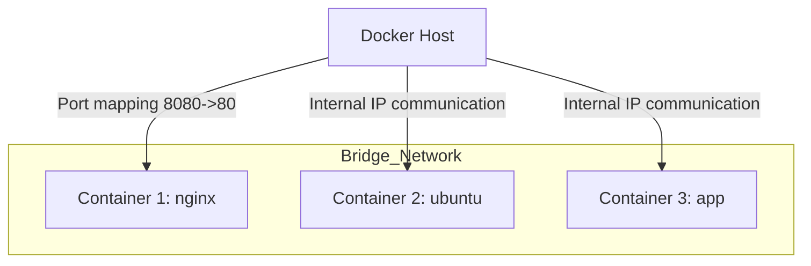
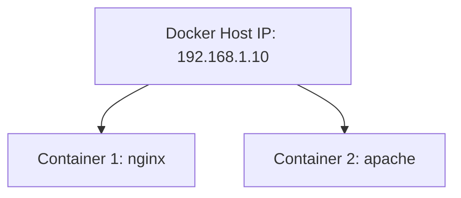
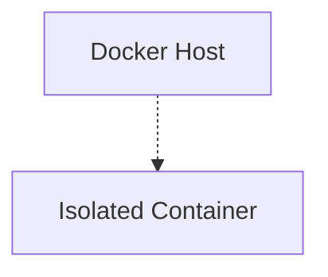
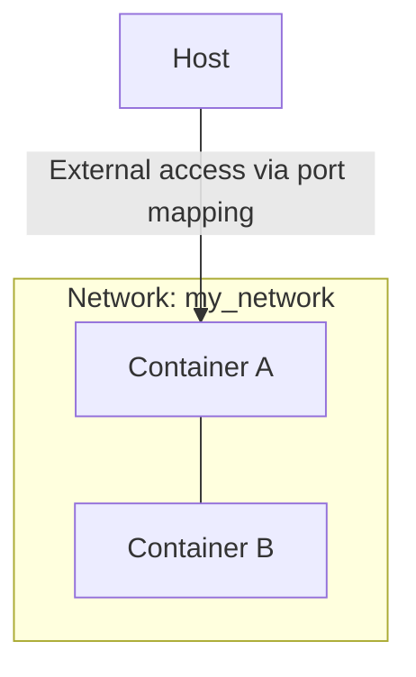
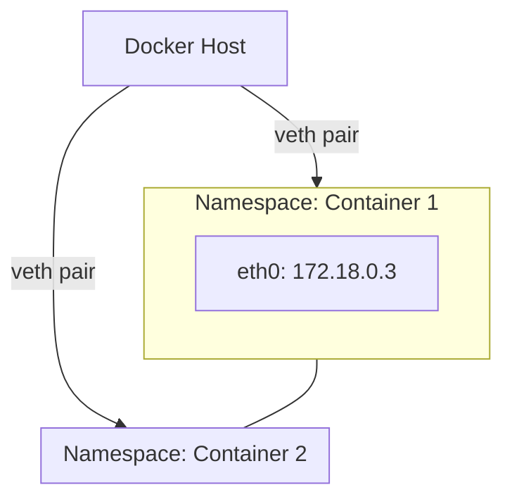

# Docker Networking — Complete Guide

Docker networking allows containers to communicate with each other and with external systems. Understanding the types of networks and how to use them is essential for building multi-container applications.

---

## Default Networks

Docker provides three default networks:

1. **bridge** (default)
2. **host**
3. **none**

---

### 1. Bridge Network (Default)

* Containers are attached to the `bridge` network by default.
* Containers get **internal IP addresses** from the bridge network.
* To access containers from outside, use **host port mapping**.

**Example:**

```bash
docker run -d -p 8080:80 nginx
```

* Container runs on internal port `80`.
* Host port `8080` maps to container port `80`.

**Visualization:**



---

### 2. Host Network

* Uses the **host’s network stack**.
* Container shares the host IP and can be accessed directly.
* Removes container network isolation.
* Limitation: Cannot run multiple containers on the same port.

**Example:**

```bash
docker run -d --network=host nginx
```

**Visualization:**



---

### 3. None Network

* Container is not attached to any network.
* Cannot communicate with other containers.
* Cannot be accessed from outside.
* Provides **pure isolation**.

**Example:**

```bash
docker run -d --network=none alpine
```

**Visualization:**



---

## User-Defined Networks

* User-defined networks allow **custom isolation** and flexible communication.
* Multiple networks can coexist on the same host.
* Containers can be attached to specific networks.

**Create a network:**

```bash
docker network create \
  --driver bridge \
  --subnet 192.168.10.0/24 \
  my_network
```

**Attach container to network:**

```bash
docker run -d --network=my_network nginx
```

**List networks:**

```bash
docker network ls
```

**Inspect a network:**

```bash
docker inspect <container_name_or_id>
```

**Visualization:**



This could be mentioned in a compose yaml file too:
```yaml
version: "3.9"
services:
  web:
    image: nginx
    networks:
      - my_network

  app:
    image: alpine
    command: sleep 1000
    networks:
      - my_network

networks:
  my_network:
    driver: bridge
```

If no IPv4 subnet is mentioned (as in the YAML above), Docker auto-chooses a default subnet for this network ```my_network```, usually something like ```172.18.0.0/16``` and containers will get IPs auto-assigned from this subnet like:      
- ``` web ``` -> 172.18.0.2
- ``` app ``` -> 172.18.0.3     
Exact IPs can vary depending on your Docker host and other networks already in use.
---

## Embedded DNS

* Docker has a built-in DNS server.
* Containers can resolve each other by **container name**.

**Example:**

```bash
# Run two containers in same network
docker run -d --name app1 --network=my_network alpine sleep 1000

docker run -it --name app2 --network=my_network alpine sh
# Inside app2 shell
ping app1
```

* `ping app1` resolves the IP automatically via Docker's embedded DNS.

---

## Network Namespaces

* Docker uses **network namespaces** to implement isolation.
* Each container gets its own namespace with interfaces, routing tables, and IPs.
* Enables isolation between containers while allowing user-defined connectivity.

**Visualization:**



---

## Summary

| Network Type | Isolation | External Access      | Notes                                              |
| ------------ | --------- | -------------------- | -------------------------------------------------- |
| bridge       | Partial   | Yes via port mapping | Default network, containers get internal IPs       |
| host         | None      | Yes directly         | Shares host IP, cannot run multiple on same port   |
| none         | Full      | No                   | Complete isolation, no communication               |
| user-defined | Custom    | Yes via mapping      | Can isolate container groups, supports DNS by name |

This guide covers the **core Docker networking concepts**, examples, and visualizations to make container communication and isolation clear and practical.
