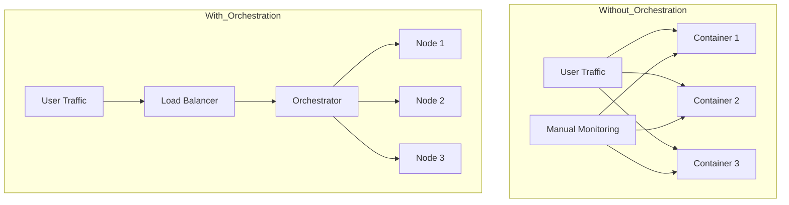
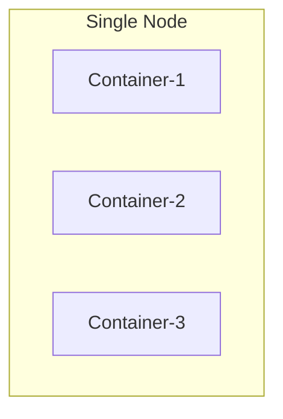
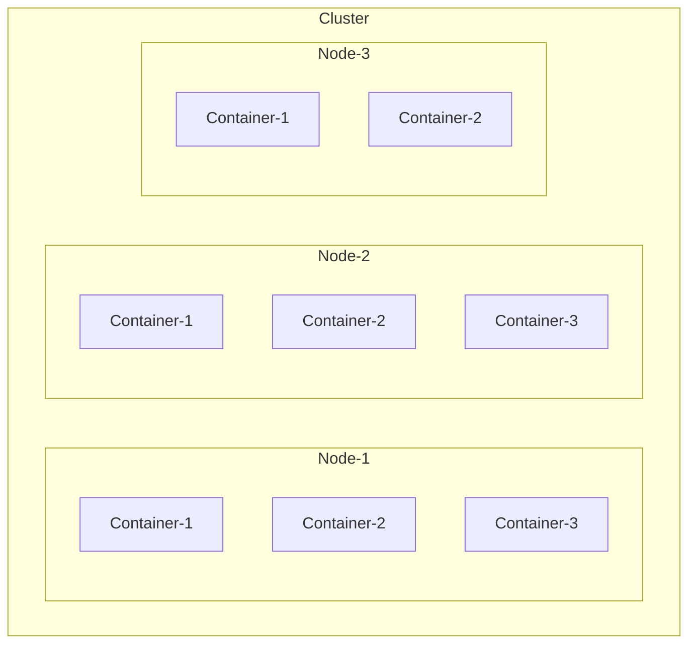
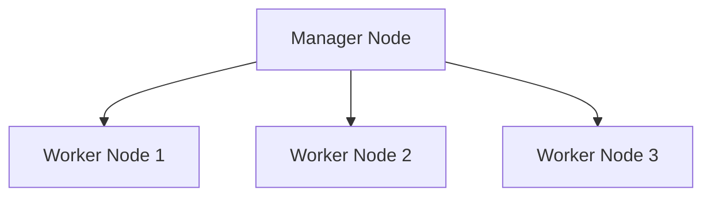
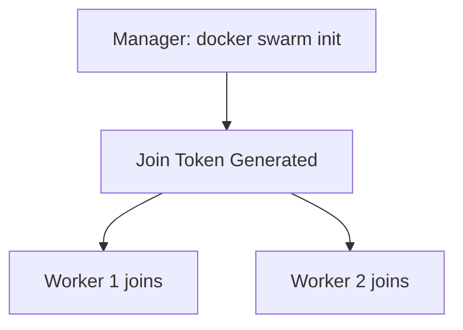
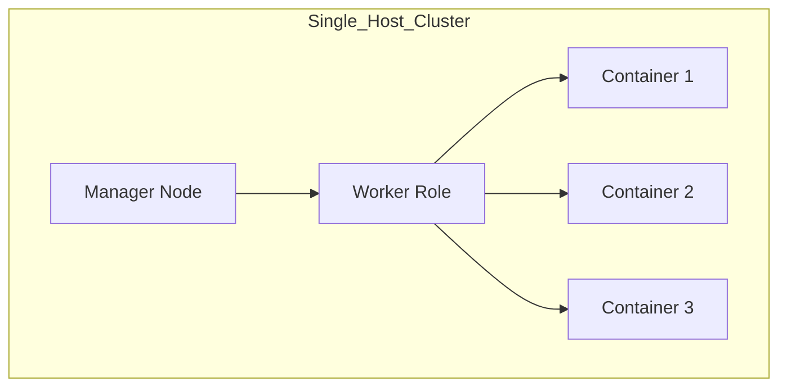
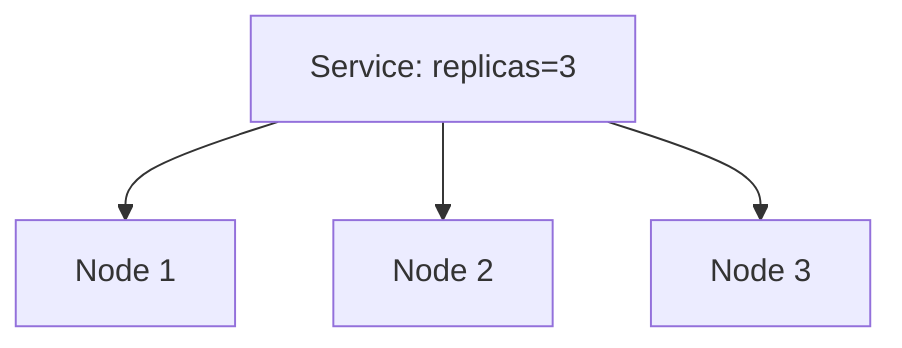

# 🐳 Docker Swarm & Container Orchestration

## 🚀 What is Container Orchestration?

Running containers manually at scale is messy:

* Start containers manually 😵
* Monitor traffic yourself 📉
* Restart crashed containers 🔁
* Handle host failures 💥
* No built-in load balancing ⚖️

👉 Container orchestration automates all of this.

### ✅ What Orchestration Does

* Deploy **100s / 1000s of containers automatically**
* Auto-restart failed containers
* Load balance traffic
* Auto-scale based on demand
* Manage networking between containers
* Handle node failures

---

## 📊 Scaling: Without vs With Orchestration



---

## 🧰 Popular Orchestration Tools

* **Docker Swarm** → Easy setup, simple to use
* **Kubernetes** → Highly customizable, industry standard
* **Apache Mesos** → Powerful but complex

---
---

# 🐝 Docker Swarm

Docker Swarm turns multiple Docker hosts into a **single cluster**.

### 💡 Key Idea

* Multiple machines = **Cluster**
* Containers distributed across machines
* Built-in **Load Balancing + High Availability (HA)**

---

## 🧠 What is a Node?

👉 A **Node** = a machine (VM/physical) in the swarm.

💡 Important:

* A node can run **multiple containers (instances)**
* These containers are called **tasks** in Swarm

---

## 🧠 What is a Cluster?

👉 A **Cluster** = collection of multiple nodes working together

💡 Important:

* Cluster = many nodes
* Node = can run many containers

---

## 📊 Node with Multiple Containers



---

## 📊 Cluster with Multiple Nodes



---

## ⚙️ Swarm Architecture



---

## 🛠️ Setting Up Docker Swarm

### 1️⃣ Initialize Swarm (on Manager)

```bash
docker swarm init
```

👉 This outputs a **join token**.

---

### 2️⃣ Join Worker Nodes

Run this on other machines:

```bash
docker swarm join --token <TOKEN> <MANAGER-IP>:2377
```

---

## 📊 Swarm Setup Visualization


---

## What happens when only a single host is present? (Eg: Your local system)
When you run:

```bash
docker swarm init
```

👉 That single machine becomes:

- Manager node 🧠
- Worker node ⚙️ (by default)

So basically:

👉 1 host = 1 node = manager + worker

---

## 📊 Single Docker Host Visualization



---
## 🚀 What you can still do

Even with one host, Swarm gives you:

- Run multiple replicas:

```bash
docker service create --replicas=5 nginx
```
- Self-healing (restarts containers if they crash)
- Service abstraction (no need to manually run containers)

---

## ⚠️ Limitations

You won’t get true distributed benefits:

- ❌ No high availability (if host dies → everything dies)
- ❌ No cross-node load balancing
- ❌ No fault tolerance

---

## 💡 When is this useful?
- Learning / practice 🧪
- Local development 💻
- Testing Swarm features before scaling

---

## 🧠 Bottom line

- 👉 Swarm on 1 host = still useful, but not “distributed” yet
- 👉 Add more hosts → you unlock real power (HA, scaling across machines)

---

## 🚀 Docker Services

👉 Instead of running containers manually, Swarm uses **Services**.

### 💡 Definition

A **Service** = Desired state of your application

* Number of replicas
* Image to run
* Network config

---

## 📊 Service Distribution



---

## 🧪 Create a Service

```bash
docker service create --name myapp --replicas=3 nginx
```

👉 Swarm automatically:

* Distributes containers across nodes
* Restarts failed ones
* Maintains desired replica count

---

## ⚡ Useful Docker Service Commands

### 📌 List services

```bash
docker service ls
```

### 📌 Inspect a service

```bash
docker service inspect myapp
```

### 📌 View running containers (tasks)

```bash
docker service ps myapp
```

### 📌 Scale service

```bash
docker service scale myapp=5
```

### 📌 Update service

```bash
docker service update --image nginx:latest myapp
```

### 📌 Remove service

```bash
docker service rm myapp
```

---

## 🔥 Advanced Service Options

```bash
docker service create \
  --name webapp \
  --replicas 5 \
  --publish 80:80 \
  --limit-cpu 0.5 \
  --limit-memory 512M \
  nginx
```

### Options Explained:

* `--replicas` → Number of containers
* `--publish` → Expose port
* `--limit-cpu` → CPU limit
* `--limit-memory` → Memory limit

---

## ⚖️ Swarm vs Others

| Feature     | Swarm 🐝 | Kubernetes ☸️ | Mesos ⚙️          |
| ----------- | -------- | ------------- | ----------------- |
| Setup       | Easy     | Medium        | Hard              |
| Flexibility | Low      | High          | Very High         |
| Use Case    | Simple   | Production    | Large-scale infra |

---

## 🧠 Final Summary

* Orchestration = automation of containers at scale
* Swarm = simple built-in Docker orchestrator
* Node = machine in cluster
* Service = desired state of app

👉 Use Swarm when you want **quick + simple orchestration** without heavy complexity.

---

🔥 Done. Clean, structured, and production-ready notes.
